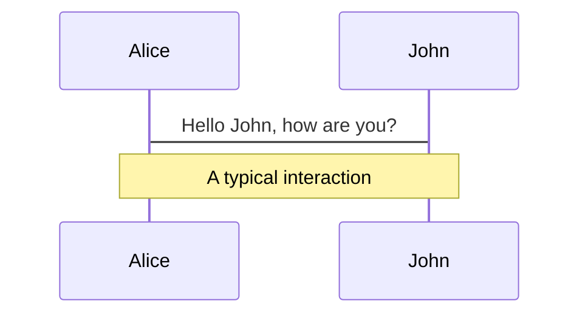
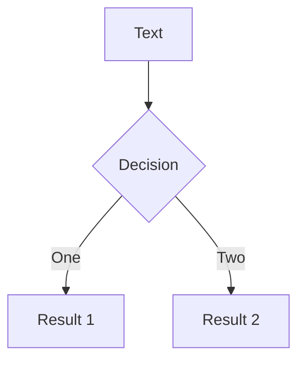
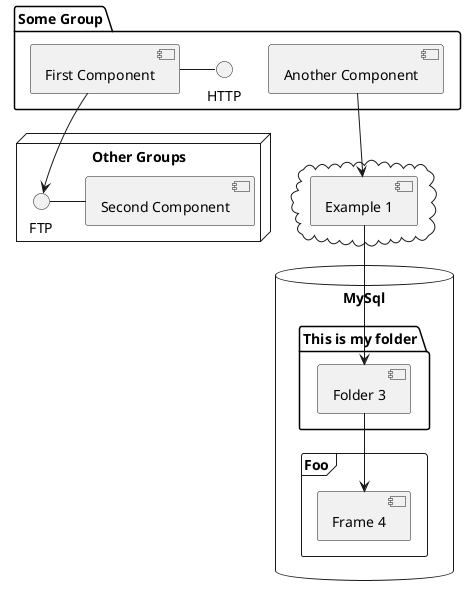

# Java Unit Testing Frameworks

by Audrey Nanual

---
layout: center
---

# Frameworks for today

1. JUnit 5
2. JUnit Pioneer
3. AssertJ
4. Data Faker
5. Mockito
6. Easy Random
7. Easy Random JUnit Extension
8. Database Rider
9. ModelAssert
10. SpringFramework Testing
11. Spring Boot Testing
12. TestContainers
13. Instancio
14. Selenide
15. JetBrains Aqua

<!--

**Library** — a collection of pre-written code that can be called by your own code to perform specific tasks or functionalities. 

**Testing framework** — a set of guidelines, rules, and conventions that dictate how tests should be structured, written, and executed. 

-->

---
layout: center
---

# JUnit 5

Features

1. Modular and extensible architecture
2. New programming model
3. Improved exception handling
4. Test templates
5. Parallel test execution
6. Improved reporting

---
layout: center
---

# JUnit Pioneer

Features

1. Enhanced test reporting
2. Improved parameterized tests
3. Test fixtures with constructor injection
4. Enhanced test data management
5. Test isolation with separate class loaders

---
layout: center
---

# AssertJ

Features

1. Fluent interface
2. Type-specific assertions
3. Chained assertions
4. Soft assertions
5. Custom error messages

---
layout: center
---

# Data Faker

Features

1. Wide variety of data types
2. Localization support
3. Customization
4. Easy integration
5. High-quality data

---
layout: center
---

# Mockito

Features

1. Simple and intuitive syntax
2. Stubbing
3. Verification
4. Spying
5. Argument matching
6. Annotation support
7. Ability to mock final classes and methods

---
layout: center
---

# Easy Random

Features

1. Fluent interface
2. Customizable
3. Supports complex object generation
4. Supports a wide range of data types
5. Automatic configuration
6. Easy integration
7. Provide randomness control

---
layout: center
---

# Easy Random JUnit Extension

Features

1. @EasyRandom
2. @WithEasyRandom
3. @EasyRandomResource
4. @Randomizer
5. @Random
6. @RandomBean

---
layout: center
---

# Database Rider

Features

1. Supports multiple database types
2. Supports data-driven testing
3. Provides fluent API for database operations
4. Integration with JUnit and TestNG
5. Supports transaction management
6. Supports assertions on database state

---
layout: center
---

# ModelAssert

Features

1. Model-based testing with graphs
2. Domain-specific assertions
3. Value object testing
4. Flexible model definition
5. Data-driven testing
6. Lightweight and easy to use

---
layout: center
---

# SpringFramework Testing

Features

1. Integration testing
2. Mock objects
3. Dependency injection
4. Annotations
5. Flexible configuration
6. Test templates

---
layout: center
---

# Spring Boot Testing

Features

1. Integration with the Spring framework
2. Support for different types of testing
3. Auto-configuration
4. Embedded servers
5. Dependency management

---
layout: center
---

# TestContainers

Features

1. Containerization
2. Wide range of supported containers
3. Automated container management
4. Dependency management
5. Simple API
6. Compatibility with existing testing frameworks

---
layout: center
---

# Instancio

Features

1. Reduces manual data setup in unit tests
2. Non-intrusive and concise API
3. Allows customization of generated objects
4. Requires no changes to production code
5. Can be used out-of-the-box with zero config

---
layout: center
---

# Selenide

Features

1. Concise and readable syntax
2. Automatic waits
3. Screenshots on failures
4. Support for multiple browsers
5. Page Object Model (POM) support
6. Fluent API
7. Automatic handling of iframes
8. Advanced assertions

---
layout: center
---

# JetBrains Aqua

Features

1. Intelligent coding assistance
2. Unit test frameworks
3. UI automation
4. Web inspector
5. API testing and environment setup
6. Database
7. TMS


---
layout: two-cols
---

<template v-slot:default>

# Left

niceu

</template>
<template v-slot:right>

# Right

noice

</template>

---
layout: center
---

# slide with numbered points

paragraph stuff

1. idea one
    1. this
    2. sucks
2. idea two
    1. doesn't
    2. look
    3. pretty

---
layout: center
---

# slide with code snippet and line highlighting

```java {all|2}
public String greet(String name) {
    String message = "Hello there, " + name;
    return message;
}
```

---
layout: center
---

# long code snippet that enables scrolling

```java {all} {maxHeight:'300px'}
public String response(String emotion) {
    switch(emotion) {
        case "sad":
            return "Everything will be alright.";
            break;
        case "happy":
            return "I'm glad you're doing well!";
            break;
        case "stressed":
            return "Let's go to Gmall.";
            break;
        default:
            return "え。そっか。";
            break;
    }
}

public String interact(String species) {
    switch(species) {
        case "cat":
            System.out.println("PSPPSPSPPSPSMEWMEWMEWMEMWE");
            break;
        case "dog":
            System.out.println("DOGGOOOOOO");
            break;
        case "owl":
            System.out.println("NOICE.");
            break;
        default:
            System.out.println("え。そっか。");
            break;
    }
}
```

---
layout: center
---

# Editable code snippet

```java {monaco}
System.out.println("Oi");
```

---
layout: center
---

# U can basically fake a before-and-after code thing

```ts {monaco-diff}
This line is removed on the right.
just some text
abcd
efgh
Some more text
~~~
just some text
abcz
zzzzefgh
Some more text.
This line is removed on the left.
```

---
layout: center
---
# Highlight words within blockquotes

> Hello `world`

<style>
blockquote {
  code {
    @apply text-teal-500 dark:text-teal-400;
  }
}
</style>

---
layout: center
---


---
layout: center
---

# Same handsome boi image but resized


---
layout: center
---

# Icons!!

Noice moving icons I guess. Get more icons here: https://icones.js.org/

<uim-rocket />
<uim-rocket class="text-3xl text-red-400 mx-2" />
<uim-rocket class="text-3xl text-orange-400 animate-ping" />

<br><br>

<pepicons-print-alarm class="text-5xl text-yellow" />
<pepicons-print-alarm class="text-6xl text-red"/>
<pepicons-print-alarm class="text-7xl text-blue animate-ping"/>

---
layout: two-cols
---

<template v-slot:default>

# slide with 2 columns

この左です。

れらは私の好きな食べ物です：
- チョコレート
- いちご
- らメン

</template>
<template v-slot:right>

# noice

このは右です。

</template>

---
layout: two-cols
---

# same concept but different syntax

this is left!

```python {all}
print("Hello world")
```

::right::

# also tried putting code snippets inside

this is right!
```python
print("HI'm ded")
```

---
layout: center
---

# Cursed math

$\sqrt{3x-1}+(1+x)^2$

$$
\begin{array}{c}

\nabla \times \vec{\mathbf{B}} -\, \frac1c\, \frac{\partial\vec{\mathbf{E}}}{\partial t} &
= \frac{4\pi}{c}\vec{\mathbf{j}}    \nabla \cdot \vec{\mathbf{E}} & = 4 \pi \rho \\

\nabla \times \vec{\mathbf{E}}\, +\, \frac1c\, \frac{\partial\vec{\mathbf{B}}}{\partial t} & = \vec{\mathbf{0}} \\

\nabla \cdot \vec{\mathbf{B}} & = 0

\end{array}
$$

---
layout: center
---

# A wonky diagram...



---
layout: center
---

# More diagram



---
layout: center
---

# press next for hidden surprises!

<!-- Component usage: this will be invisible until you press "next" -->
<v-click>

hey

</v-click>

<v-click>

did you know
</v-click>


<v-click>

that you're

</v-click>

<v-click>

doing well

</v-click>

<!-- Directive usage: this will be invisible until you press "next" the second time -->
<div v-click class="text-xl p-2">
woohoo!
</div>

---
layout: center
---

# idk understand this

<div v-click>Hello</div>
<div v-after>World</div>

--
layout: center
---

# disappear!

<div v-click-hide>Hello</div>


<!-- ======================　UM, MORE STUFF!! ================== -->

---
# try also 'default' to start simple
theme: seriph
# random image from a curated Unsplash collection by Anthony
# like them? see https://unsplash.com/collections/94734566/slidev
background: https://source.unsplash.com/collection/94734566/1920x1080
# apply any windi css classes to the current slide
class: 'text-center'
# https://sli.dev/custom/highlighters.html
highlighter: shiki
# show line numbers in code blocks
lineNumbers: false
# some information about the slides, markdown enabled
info: |
  ## Slidev Starter Template
  Presentation slides for developers.

  Learn more at [Sli.dev](https://sli.dev)
# persist drawings in exports and build
drawings:
  persist: false
# page transition
transition: slide-left
# use UnoCSS
css: unocss
---

# Welcome to Slidev

All the stuff starting this slide are from the default Slidev template

<div class="pt-12">
  <span @click="$slidev.nav.next" class="px-2 py-1 rounded cursor-pointer" hover="bg-white bg-opacity-10">
    Press Space for next page <carbon:arrow-right class="inline"/>
  </span>
</div>

<div class="abs-br m-6 flex gap-2">
  <button @click="$slidev.nav.openInEditor()" title="Open in Editor" class="text-xl slidev-icon-btn opacity-50 !border-none !hover:text-white">
    <carbon:edit />
  </button>
  <a href="https://github.com/slidevjs/slidev" target="_blank" alt="GitHub"
    class="text-xl slidev-icon-btn opacity-50 !border-none !hover:text-white">
    <carbon-logo-github />
  </a>
</div>

<!--
The last comment block of each slide will be treated as slide notes. It will be visible and editable in Presenter Mode along with the slide. [Read more in the docs](https://sli.dev/guide/syntax.html#notes)
-->

---
transition: fade-out
---

# What is Slidev?

Slidev is a slides maker and presenter designed for developers, consist of the following features

- 📝 **Text-based** - focus on the content with Markdown, and then style them later
- 🎨 **Themable** - theme can be shared and used with npm packages
- 🧑‍💻 **Developer Friendly** - code highlighting, live coding with autocompletion
- 🤹 **Interactive** - embedding Vue components to enhance your expressions
- 🎥 **Recording** - built-in recording and camera view
- 📤 **Portable** - export into PDF, PNGs, or even a hostable SPA
- 🛠 **Hackable** - anything possible on a webpage

<br>
<br>

Read more about [Why Slidev?](https://sli.dev/guide/why)

<!--
You can have `style` tag in markdown to override the style for the current page.
Learn more: https://sli.dev/guide/syntax#embedded-styles
-->

<style>
h1 {
  background-color: #2B90B6;
  background-image: linear-gradient(45deg, #4EC5D4 10%, #146b8c 20%);
  background-size: 100%;
  -webkit-background-clip: text;
  -moz-background-clip: text;
  -webkit-text-fill-color: transparent;
  -moz-text-fill-color: transparent;
}
</style>

<!--
Here is another comment.
-->

---
transition: slide-up
---

# Navigation

Hover on the bottom-left corner to see the navigation's controls panel, [learn more](https://sli.dev/guide/navigation.html)

### Keyboard Shortcuts

|     |     |
| --- | --- |
| <kbd>right</kbd> / <kbd>space</kbd>| next animation or slide |
| <kbd>left</kbd>  / <kbd>shift</kbd><kbd>space</kbd> | previous animation or slide |
| <kbd>up</kbd> | previous slide |
| <kbd>down</kbd> | next slide |

<!-- https://sli.dev/guide/animations.html#click-animations -->

<p v-after class="absolute bottom-23 left-45 opacity-30 transform -rotate-10">Here!</p>

---
layout: image-right
image: https://source.unsplash.com/collection/94734566/1920x1080
---

# Code

Use code snippets and get the highlighting directly![^1]

```ts {all|2|1-6|9|all}
interface User {
  id: number
  firstName: string
  lastName: string
  role: string
}

function updateUser(id: number, update: User) {
  const user = getUser(id)
  const newUser = { ...user, ...update }
  saveUser(id, newUser)
}
```

<arrow v-click="3" x1="400" y1="420" x2="230" y2="330" color="#564" width="3" arrowSize="1" />

[^1]: [Learn More](https://sli.dev/guide/syntax.html#line-highlighting)

<style>
.footnotes-sep {
  @apply mt-20 opacity-10;
}
.footnotes {
  @apply text-sm opacity-75;
}
.footnote-backref {
  display: none;
}
</style>

---

# Components

<div grid="~ cols-2 gap-4">
<div>

You can use Vue components directly inside your slides.

We have provided a few built-in components like `<Tweet/>` and `<Youtube/>` that you can use directly. And adding your custom components is also super easy.

```html
<Counter :count="10" />
```

<!-- ./components/Counter.vue -->
<Counter :count="10" m="t-4" />

Check out [the guides](https://sli.dev/builtin/components.html) for more.

</div>
<div>

```html
<Tweet id="1390115482657726468" />
```

<Tweet id="1390115482657726468" scale="0.65" />

</div>
</div>

<!--
Presenter note with **bold**, *italic*, and ~~striked~~ text.

Also, HTML elements are valid:
<div class="flex w-full">
  <span style="flex-grow: 1;">Left content</span>
  <span>Right content</span>
</div>
-->


---
class: px-20
---

# Themes

Slidev comes with powerful theming support. Themes can provide styles, layouts, components, or even configurations for tools. Switching between themes by just **one edit** in your frontmatter:

<div grid="~ cols-2 gap-2" m="-t-2">

```yaml
---
theme: default
---
```

```yaml
---
theme: seriph
---
```


</div>

Read more about [How to use a theme](https://sli.dev/themes/use.html) and
check out the [Awesome Themes Gallery](https://sli.dev/themes/gallery.html).

---
preload: false
---

# Animations

Animations are powered by [@vueuse/motion](https://motion.vueuse.org/).

```html
<div
  v-motion
  :initial="{ x: -80 }"
  :enter="{ x: 0 }">
  Slidev
</div>
```

<div class="w-60 relative mt-6">
  <div class="relative w-40 h-40">
    
    
    
  </div>

  <div
    class="text-5xl absolute top-14 left-40 text-[#2B90B6] -z-1"
    v-motion
    :initial="{ x: -80, opacity: 0}"
    :enter="{ x: 0, opacity: 1, transition: { delay: 2000, duration: 1000 } }">
    Slidev
  </div>
</div>

<!-- vue script setup scripts can be directly used in markdown, and will only affects current page -->
<script setup lang="ts">
const final = {
  x: 0,
  y: 0,
  rotate: 0,
  scale: 1,
  transition: {
    type: 'spring',
    damping: 10,
    stiffness: 20,
    mass: 2
  }
}
</script>

<div
  v-motion
  :initial="{ x:35, y: 40, opacity: 0}"
  :enter="{ y: 0, opacity: 1, transition: { delay: 3500 } }">

[Learn More](https://sli.dev/guide/animations.html#motion)

</div>

---

# LaTeX

LaTeX is supported out-of-box powered by [KaTeX](https://katex.org/).

<br>

Inline $\sqrt{3x-1}+(1+x)^2$

Block
$$
\begin{array}{c}

\nabla \times \vec{\mathbf{B}} -\, \frac1c\, \frac{\partial\vec{\mathbf{E}}}{\partial t} &
= \frac{4\pi}{c}\vec{\mathbf{j}}    \nabla \cdot \vec{\mathbf{E}} & = 4 \pi \rho \\

\nabla \times \vec{\mathbf{E}}\, +\, \frac1c\, \frac{\partial\vec{\mathbf{B}}}{\partial t} & = \vec{\mathbf{0}} \\

\nabla \cdot \vec{\mathbf{B}} & = 0

\end{array}
$$

<br>

[Learn more](https://sli.dev/guide/syntax#latex)

---

# Diagrams

You can create diagrams / graphs from textual descriptions, directly in your Markdown.

<div class="grid grid-cols-3 gap-10 pt-4 -mb-6">




</div>

[Learn More](https://sli.dev/guide/syntax.html#diagrams)

---
src: ./pages/multiple-entries.md
hide: false
---

---
layout: center
class: text-center
---

# Learn More

[Documentations](https://sli.dev) · [GitHub](https://github.com/slidevjs/slidev) · [Showcases](https://sli.dev/showcases.html)
