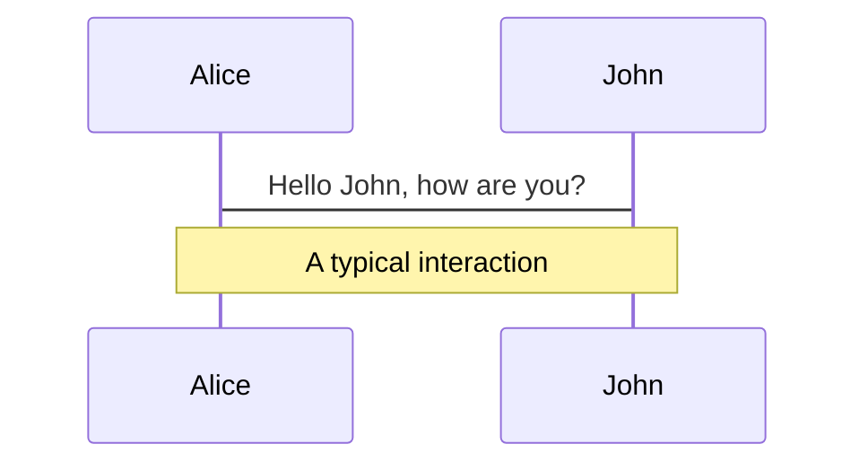
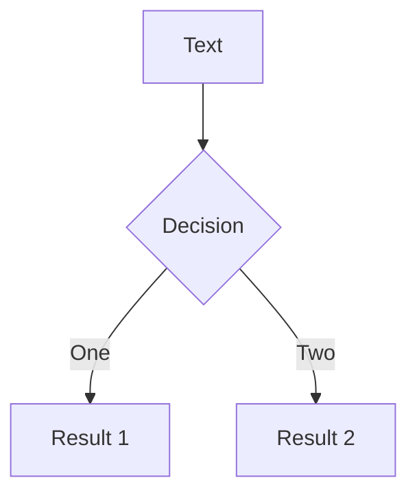
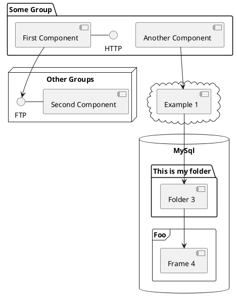

# Java Unit Testing Frameworks, Libraries, and Tools

by Audrey Nanual

---
layout: center
---

### **Testing Framework**
-  a collection of reusable code that provides functionality to support unit testing, such as _assertion methods_, _mock objects_, or _test data generators_
- e.g. JUnit 5, Mockito, SpringFramework Testing, Spring Boot Testing, Selenide

<br>

### **Testing Library**
- a set of conventions and rules that define how tests are written, organized, and executed
- provides a structure for writing test cases and automates the process of executing them, reporting results, and providing feedback
- e.g. AssertJ, Data Faker, Easy Random, Easy Random JUnit Extension, ModelAssert, 

<br>

### **Testing Tool**
- a software application that helps developers automate and manage the process of testing software, providing functionality beyond what is available in testing libraries or frameworks
- e.g. JUnit Pioneer, Database Rider, TestContainers, Instancio, JetBrains Aqua

---
layout: center
---

# Frameworks, libraries, and tools for today

1. JUnit 5
2. JUnit Pioneer
3. AssertJ
4. Data Faker
5. Mockito
6. Easy Random
7. Easy Random JUnit Extension
8. Database Rider
9. ModelAssert
10. SpringFramework Testing
11. Spring Boot Testing
12. TestContainers
13. Instancio
14. Selenide
15. JetBrains Aqua

<!--

**Library** — a collection of pre-written code that can be called by your own code to perform specific tasks or functionalities. 

**Testing framework** — a set of guidelines, rules, and conventions that dictate how tests should be structured, written, and executed. 

-->

---
layout: center
---

# JUnit 5

“Powerful and flexible Java testing framework”

> Latest version of the popular Java testing framework, JUnit.

> Provides a range of new features and enhancements to help developers write more efficient, effective, and maintainable tests.

<style>
blockquote {
  code {
    @apply text-teal-500 dark:text-teal-400;
  }
}
</style>

<br>

1. Modular and extensible architecture
2. New programming model (i.e., @Nested, @ParameterizedTest, @DynamicTest)
3. Improved exception handling
4. Test templates
5. Parallel test execution
6. Improved reporting

<!-- 

**FEATURE 1.**
- Has a modular architecture that allows you to use only the parts of the framework that you need.
- Allows you to add your own custom extensions to the framework, making it more flexible and adaptable to your specific testing needs.

**FEATURE 2.**
- Includes annotations and interfaces for writing tests and test extensions.
- Allows for more flexible and expressive tests, with features like nested tests (_@Nested_), parameterized tests (_@ParameterizedTest_), and dynamic tests (_@DynamicTest_).
- 

**FEATURE 3.**
- Provides a new _assertThrows()_ method that makes it easier to test for expected exceptions.
- This method takes a lambda expression and checks that it throws an exception of the specified type.

**FEATURE 4.**
- Includes a new _@TestTemplate_ annotation that allows you to define a test template that can be reused across multiple test cases.
- This can save time and reduce duplication in your tests.

**FEATURE 5.**
- Supports parallel test execution, which can greatly reduce the time it takes to run your test suite.
- You can configure JUnit to run tests in parallel across multiple threads or processes, depending on your needs.

**FEATURE 6.**
- Provides more detailed and customizable test reports, with support for different output formats and styles.
- Can help you to better understand the results of your tests and identify areas for improvement.

 -->

---
layout: center
---

# JUnit Pioneer

“Making JUnit 5 testing simpler and more accessible”

> A community-driven effort to improve the quality and effectiveness of JUnit tests,

> through the development and promotion of best practices, tools, and educational resources.

<style>
blockquote {
  code {
    @apply text-teal-500 dark:text-teal-400;
  }
}
</style>

<br>

1. Enhanced test reporting
2. Improved parameterized tests
3. Test fixtures with constructor injection
4. Enhanced test data management
5. Test isolation with separate class loaders

<!-- 

**FEATURE 1.**
- Provides more informative test reporting than standard JUnit 5, with additional information such as the stack traces of all exceptions thrown during a test run.
- The test results can be easily customized to include the information that you need.

**FEATURE 2.**
- Are more flexible and informative than in standard JUnit 5.
- Provide better test output and reporting.
- e.g. Test inputs and outputs can be automatically formatted and displayed in a readable format, making it easier to understand and debug tests.

**FEATURE 3.**

**_Test fixture_** — refers to the preparation of the environment, including the [1] creation of objects, [2] setting up the required data, and [3] defining the initial state of the system under test, to ensure that the test is executed in a known and controlled context. 

- Supports test fixtures with constructor injection, which allows for more flexible test setup and teardown.
- Enables you to declare constructor parameters and initialize them automatically before each test.
- Constructor injection can be used to set up objects that will be used in multiple tests.

**FEATURE 4.**
- Provides annotations and utilities for defining and managing test data, making it easier to write test cases that cover different scenarios.
- Allows you to define complex test data structures and manage them with ease.
- Can also help avoid code duplication by allowing you to reuse test data across multiple test cases.

**FEATURE 5.**

**_Class loader_** — responsible for finding and loading Java classes (from the file system, network or other sources) into memory as they are referenced by a Java program at runtime. 

- Allows you to run tests in separate class loaders, which can improve test isolation and reduce test execution time. 
- Allows you to run tests in parallel without having to worry about shared state or dependencies.
- Mkes it easier to test code that depends on external resources, such as databases or web services, by isolating the test environment from the production environment.

 -->

---
layout: center
---

# AssertJ

“Readable and comprehensive assertions for Java”

> A fluent assertions library for Java that provides a more

> readable and comprehensive way of writing assertions in unit tests.

<style>
blockquote {
  code {
    @apply text-teal-500 dark:text-teal-400;
  }
}
</style>

<br>

1. Fluent interface —— ❌ assertTrue(x > 0) | ✅ assertThat(x).isGreaterThan(0)
2. Type-specific assertions (i.e., collections, strings, dates, and exceptions)
3. Chained assertions
```java
assertThat(str)
      .startsWith("JUnit")
      .endsWith("framework")
      .contains("unit testing");
```
4. Soft assertions

5. Custom error messages

<!-- 

**FEATURE 1.**
- Allows you to write assertions that read like natural language statements.
- e.g. Instead of writing _assertTrue(x > 0)_, you can write _assertThat(x).isGreaterThan(0)_.

**FEATURE 2.**
- Provides specific assertion methods for different types of objects, such as collections, strings, dates, and exceptions
- Makes it easy to write assertions that are tailored to the specific types you are working with.

**FEATURE 3.**
- You can chain multiple assertions together using the and method.
- Allows you to perform multiple assertions on the same object in a single statement, which can make your tests more readable and concise.

**FEATURE 4.**
- Supports soft assertions, which allow you to continue running assertions even if one of them fails.
- Can be useful in cases where you want to report all the failures in a test, rather than stopping at the first failure.

**FEATURE 5.**
- Allows you to provide custom error messages for your assertions, which can make it easier to understand what went wrong when an assertion fails.

 -->

---
layout: center
---

# Data Faker

“Realistic data generation made easy”

> A Java library that generates realistic and randomized test data for a wide range of data types,

> allowing developers to quickly and easily populate their unit tests with diverse and comprehensive test data.

<style>
blockquote {
  code {
    @apply text-teal-500 dark:text-teal-400;
  }
}
</style>

<br>

1. Wide variety of data types
2. Localization support
3. Customization
4. Easy integration
5. High-quality data

<!-- 

**FEATURE 1.**
- Supports a wide range of data types such as names, addresses, phone numbers, dates, times, credit card numbers, and more.
- Makes it easy to generate realistic test data for a variety of applications.

**FEATURE 2.**
- Supports multiple languages and locales, which allows you to generate data that is specific to a particular country or region.
- e.g. You can generate names, addresses, and phone numbers that are specific to the United States, United Kingdom, or France.

**FEATURE 3.**
- Provides a way to customize the generated data by specifying your own data patterns or by providing your own data sets.
- Is useful when you need to generate data that is specific to your application or domain.

**FEATURE 4.**
- Can be easily integrated into your Java projects using Maven or Gradle.
- Provides a simple API that allows you to generate data programmatically in your Java code.

**FEATURE 5.**
- Generates high-quality data that is realistic and conforms to common patterns and formats.
- Ensures that your tests are accurate, reliable, and comprehensive.

 -->

---
layout: center
---

# Mockito

“Mocking framework for unit testing in Java”

>  A Java mocking framework that allows developers to create mock objects, stub method behavior,

> and verify the interactions between objects in unit tests.

<style>
blockquote {
  code {
    @apply text-teal-500 dark:text-teal-400;
  }
}
</style>

<br>

1. Simple and intuitive syntax
2. Stubbing
3. Verification
4. Spying
5. Argument matching
6. Annotation support
7. Ability to mock final classes and methods

<!-- 

**FEATURE 1.**


**FEATURE 2.**


**FEATURE 3.**


**FEATURE 4.**


**FEATURE 5.**


 -->

---
layout: center
---

# Easy Random

“Flexible test data generation”

> A Java library that simplifies the process of generating randomized test data,

> making it easier to write comprehensive and efficient tests.

<style>
blockquote {
  code {
    @apply text-teal-500 dark:text-teal-400;
  }
}
</style>

<br>

1. Fluent interface
2. Customizable
3. Supports complex object generation
4. Supports a wide range of data types
5. Automatic configuration
6. Easy integration
7. Provide randomness control

<!-- 

**FEATURE 1.**


**FEATURE 2.**


**FEATURE 3.**


**FEATURE 4.**


**FEATURE 5.**


 -->

---
layout: center
---

# Easy Random JUnit Extension

“Seamless test data generation”

> A testing tool that simplifies the process of generating randomized test data in JUnit tests, reducing the amount of 

> boilerplate code required for data setup and allowing for more comprehensive and efficient testing.

<style>
blockquote {
  code {
    @apply text-teal-500 dark:text-teal-400;
  }
}
</style>

<br>

1. @EasyRandom
2. @WithEasyRandom
3. @EasyRandomResource
4. @Randomizer
5. @Random
6. @RandomBean

<!-- 

**FEATURE 1.**


**FEATURE 2.**


**FEATURE 3.**


**FEATURE 4.**


**FEATURE 5.**


 -->

---
layout: center
---

# Database Rider

“Database testing made easy”

> A testing tool that provides support for testing database-related functionality in Java applications,

> allowing developers to create and manage test data and execute tests in an automated and repeatable manner.

<style>
blockquote {
  code {
    @apply text-teal-500 dark:text-teal-400;
  }
}
</style>

<br>

1. Supports multiple database types
2. Supports data-driven testing
3. Provides fluent API for database operations
4. Integration with JUnit and TestNG
5. Supports transaction management
6. Supports assertions on database state

<!-- 

**FEATURE 1.**


**FEATURE 2.**


**FEATURE 3.**


**FEATURE 4.**


**FEATURE 5.**


 -->

---
layout: center
---

# ModelAssert

“Model-based testing”

> A Java testing library that allows developers to define models for objects and collections,

> and then use these models to assert that the state and behavior of objects and collections conform to expected models.

<style>
blockquote {
  code {
    @apply text-teal-500 dark:text-teal-400;
  }
}
</style>

<br>

1. Model-based testing with graphs
2. Domain-specific assertions
3. Value object testing
4. Flexible model definition
5. Data-driven testing
6. Lightweight and easy to use

<!-- 

**FEATURE 1.**


**FEATURE 2.**


**FEATURE 3.**


**FEATURE 4.**


**FEATURE 5.**


 -->

---
layout: center
---

# SpringFramework Testing

“Simplified testing of Spring applications”

> Provides support for testing Spring-based applications, including unit testing, integration testing, 

> and end-to-end testing, using a variety of testing frameworks and tools.

<style>
blockquote {
  code {
    @apply text-teal-500 dark:text-teal-400;
  }
}
</style>

<br>

1. Integration testing
2. Mock objects
3. Dependency injection
4. Annotations
5. Flexible configuration
6. Test templates

<!-- 

**FEATURE 1.**


**FEATURE 2.**


**FEATURE 3.**


**FEATURE 4.**


**FEATURE 5.**


 -->

---
layout: center
---

# Spring Boot Testing

“Testing made easy for Spring Boot”

> A module of the Spring Boot framework that provides support for testing Spring Boot applications,

> including unit testing, integration testing, and end-to-end testing.

<style>
blockquote {
  code {
    @apply text-teal-500 dark:text-teal-400;
  }
}
</style>

<br>

1. Integration with the Spring framework
2. Support for different types of testing
3. Auto-configuration
4. Embedded servers
5. Dependency management

<!-- 

**FEATURE 1.**


**FEATURE 2.**


**FEATURE 3.**


**FEATURE 4.**


**FEATURE 5.**


 -->

---
layout: center
---

# TestContainers

“Containerized testing made simple”

> A Java testing library that allows developers to easily create and manage disposable test containers,

> such as databases, for their unit and integration tests.

<style>
blockquote {
  code {
    @apply text-teal-500 dark:text-teal-400;
  }
}
</style>

<br>

1. Containerization
2. Wide range of supported containers
3. Automated container management
4. Dependency management
5. Simple API
6. Compatibility with existing testing frameworks

<!-- 

**FEATURE 1.**


**FEATURE 2.**


**FEATURE 3.**


**FEATURE 4.**


**FEATURE 5.**


 -->

---
layout: center
---

# Instancio

“Dynamic test data generation library”

> A library for instantiating and populating objects with random data, making your tests more dynamic

<style>
blockquote {
  code {
    @apply text-teal-500 dark:text-teal-400;
  }
}
</style>

<br>

1. Reduces manual data setup in unit tests
2. Non-intrusive and concise API
3. Allows customization of generated objects
4. Requires no changes to production code
5. Can be used out-of-the-box with zero config

<!-- 

**FEATURE 1.**


**FEATURE 2.**


**FEATURE 3.**


**FEATURE 4.**


**FEATURE 5.**


 -->

---
layout: center
---

# Selenide

"Java UI testing made easy."

> A concise and easy-to-use Java-based UI automation testing framework that leverages the Selenium WebDriver library.

<style>
blockquote {
  code {
    @apply text-teal-500 dark:text-teal-400;
  }
}
</style>

<br>

1. Concise and readable syntax
2. Automatic waits
3. Screenshots on failures
4. Support for multiple browsers
5. Page Object Model (POM) support
6. Fluent API
7. Automatic handling of iframes
8. Advanced assertions

<!-- 

**FEATURE 1.**


**FEATURE 2.**


**FEATURE 3.**


**FEATURE 4.**


**FEATURE 5.**


 -->

---
layout: center
---

# JetBrains Aqua

"A powerful new IDE for test automation"

> A powerful tool for testing automation that incorporates parts of various IDEs, targeting the testing automation process.

<style>
blockquote {
  code {
    @apply text-teal-500 dark:text-teal-400;
  }
}
</style>

<br>

1. Intelligent coding assistance
2. Unit test frameworks
3. UI automation
4. Web inspector
5. API testing and environment setup
6. Database
7. TMS


<!-- 

**FEATURE 1.**


**FEATURE 2.**


**FEATURE 3.**


**FEATURE 4.**


**FEATURE 5.**


 -->

---
layout: center
---

# Summary

1. **_JUnit 5_** — A popular unit testing framework for Java.
2. **_JUnit Pioneer_** — An open-source testing tool that extends JUnit 5 to provide additional testing features.
3. **_AssertJ_** — A library that provides fluent assertions for Java.
4. **_Data Faker_** — A library that generates random data for testing purposes.
5. **_Mockito_** — A mocking framework for Java that allows you to create mock objects for testing.

---
layout: center
---

# Summary (cont.)

6. **_Easy Random_** — A library that generates random data for testing purposes.
7. **_Easy Random JUnit Extension_** — An extension to the Easy Random library that integrates with JUnit 5 to generate random test data.
8. **_Database Rider_** — A testing tool that provides a convenient way to manage and populate database instances for testing purposes.
9. **_ModelAssert_** — A library that provides fluent assertions for testing object models.
10. **_SpringFramework Testing_** — A testing framework that provides support for testing Spring-based applications.

---
layout: center
---

# Summary (cont.)

11. **_Spring Boot Testing_** — A testing framework that provides support for testing Spring Boot applications.
12. **_TestContainers_** — A testing tool that allows you to easily run applications in containers for testing purposes.
13. **_Instancio_** — A testing tool that generates test data by analyzing the source code of the classes being tested.
14. **_Selenide_** — A testing framework that provides a concise API for writing UI tests using Selenium WebDriver.
15. **_JetBrains Aqua_** — A testing tool that provides a simple and intuitive way to test Java applications using a web-based interface.


---
layout: center
---

### More info on the presented testing tools


---
layout: end
---


<!-- ==================================== CUT-OFF ==================================== -->

---
layout: two-cols
---

<template v-slot:default>

# Left

niceu

</template>
<template v-slot:right>

# Right

noice

</template>

---
layout: center
---

# slide with numbered points

paragraph stuff

1. idea one
    1. this
    2. sucks
2. idea two
    1. doesn't
    2. look
    3. pretty

---
layout: center
---

# slide with code snippet and line highlighting

```java {all|2}
public String greet(String name) {
    String message = "Hello there, " + name;
    return message;
}
```

---
layout: center
---

# long code snippet that enables scrolling

```java {all} {maxHeight:'300px'}
public String response(String emotion) {
    switch(emotion) {
        case "sad":
            return "Everything will be alright.";
            break;
        case "happy":
            return "I'm glad you're doing well!";
            break;
        case "stressed":
            return "Let's go to Gmall.";
            break;
        default:
            return "え。そっか。";
            break;
    }
}

public String interact(String species) {
    switch(species) {
        case "cat":
            System.out.println("PSPPSPSPPSPSMEWMEWMEWMEMWE");
            break;
        case "dog":
            System.out.println("DOGGOOOOOO");
            break;
        case "owl":
            System.out.println("NOICE.");
            break;
        default:
            System.out.println("え。そっか。");
            break;
    }
}
```

---
layout: center
---

# Editable code snippet

```java {monaco}
System.out.println("Oi");
```

---
layout: center
---

# U can basically fake a before-and-after code thing

```ts {monaco-diff}
This line is removed on the right.
just some text
abcd
efgh
Some more text
~~~
just some text
abcz
zzzzefgh
Some more text.
This line is removed on the left.
```

---
layout: center
---
# Highlight words within blockquotes

> Hello `world`

<style>
blockquote {
  code {
    @apply text-teal-500 dark:text-teal-400;
  }
}
</style>

---
layout: center
---


---
layout: center
---

# Same handsome boi image but resized


---
layout: center
---

# Icons!!

Noice moving icons I guess. Get more icons here: https://icones.js.org/

<uim-rocket />
<uim-rocket class="text-3xl text-red-400 mx-2" />
<uim-rocket class="text-3xl text-orange-400 animate-ping" />

<br><br>

<pepicons-print-alarm class="text-5xl text-yellow" />
<pepicons-print-alarm class="text-6xl text-red"/>
<pepicons-print-alarm class="text-7xl text-blue animate-ping"/>

---
layout: two-cols
---

<template v-slot:default>

# slide with 2 columns

この左です。

れらは私の好きな食べ物です：
- チョコレート
- いちご
- らメン

</template>
<template v-slot:right>

# noice

このは右です。

</template>

---
layout: two-cols
---

# same concept but different syntax

this is left!

```python {all}
print("Hello world")
```

::right::

# also tried putting code snippets inside

this is right!
```python
print("HI'm ded")
```

---
layout: center
---

# Cursed math

$\sqrt{3x-1}+(1+x)^2$

$$
\begin{array}{c}

\nabla \times \vec{\mathbf{B}} -\, \frac1c\, \frac{\partial\vec{\mathbf{E}}}{\partial t} &
= \frac{4\pi}{c}\vec{\mathbf{j}}    \nabla \cdot \vec{\mathbf{E}} & = 4 \pi \rho \\

\nabla \times \vec{\mathbf{E}}\, +\, \frac1c\, \frac{\partial\vec{\mathbf{B}}}{\partial t} & = \vec{\mathbf{0}} \\

\nabla \cdot \vec{\mathbf{B}} & = 0

\end{array}
$$

---
layout: center
---

# A wonky diagram...



---
layout: center
---

# More diagram



---
layout: center
---

# press next for hidden surprises!

<!-- Component usage: this will be invisible until you press "next" -->
<v-click>

hey

</v-click>

<v-click>

did you know
</v-click>


<v-click>

that you're

</v-click>

<v-click>

doing well

</v-click>

<!-- Directive usage: this will be invisible until you press "next" the second time -->
<div v-click class="text-xl p-2">
woohoo!
</div>

---
layout: center
---

# idk understand this

<div v-click>Hello</div>
<div v-after>World</div>

--
layout: center
---

# disappear!

<div v-click-hide>Hello</div>


<!-- ======================　UM, MORE STUFF!! ================== -->

---
# try also 'default' to start simple
theme: seriph
# random image from a curated Unsplash collection by Anthony
# like them? see https://unsplash.com/collections/94734566/slidev
background: https://source.unsplash.com/collection/94734566/1920x1080
# apply any windi css classes to the current slide
class: 'text-center'
# https://sli.dev/custom/highlighters.html
highlighter: shiki
# show line numbers in code blocks
lineNumbers: false
# some information about the slides, markdown enabled
info: |
  ## Slidev Starter Template
  Presentation slides for developers.

  Learn more at [Sli.dev](https://sli.dev)
# persist drawings in exports and build
drawings:
  persist: false
# page transition
transition: slide-left
# use UnoCSS
css: unocss
---

# Welcome to Slidev

All the stuff starting this slide are from the default Slidev template

<div class="pt-12">
  <span @click="$slidev.nav.next" class="px-2 py-1 rounded cursor-pointer" hover="bg-white bg-opacity-10">
    Press Space for next page <carbon:arrow-right class="inline"/>
  </span>
</div>

<div class="abs-br m-6 flex gap-2">
  <button @click="$slidev.nav.openInEditor()" title="Open in Editor" class="text-xl slidev-icon-btn opacity-50 !border-none !hover:text-white">
    <carbon:edit />
  </button>
  <a href="https://github.com/slidevjs/slidev" target="_blank" alt="GitHub"
    class="text-xl slidev-icon-btn opacity-50 !border-none !hover:text-white">
    <carbon-logo-github />
  </a>
</div>

<!--
The last comment block of each slide will be treated as slide notes. It will be visible and editable in Presenter Mode along with the slide. [Read more in the docs](https://sli.dev/guide/syntax.html#notes)
-->

---
transition: fade-out
---

# What is Slidev?

Slidev is a slides maker and presenter designed for developers, consist of the following features

- 📝 **Text-based** - focus on the content with Markdown, and then style them later
- 🎨 **Themable** - theme can be shared and used with npm packages
- 🧑‍💻 **Developer Friendly** - code highlighting, live coding with autocompletion
- 🤹 **Interactive** - embedding Vue components to enhance your expressions
- 🎥 **Recording** - built-in recording and camera view
- 📤 **Portable** - export into PDF, PNGs, or even a hostable SPA
- 🛠 **Hackable** - anything possible on a webpage

<br>
<br>

Read more about [Why Slidev?](https://sli.dev/guide/why)

<!--
You can have `style` tag in markdown to override the style for the current page.
Learn more: https://sli.dev/guide/syntax#embedded-styles
-->

<style>
h1 {
  background-color: #2B90B6;
  background-image: linear-gradient(45deg, #4EC5D4 10%, #146b8c 20%);
  background-size: 100%;
  -webkit-background-clip: text;
  -moz-background-clip: text;
  -webkit-text-fill-color: transparent;
  -moz-text-fill-color: transparent;
}
</style>

<!--
Here is another comment.
-->

---
transition: slide-up
---

# Navigation

Hover on the bottom-left corner to see the navigation's controls panel, [learn more](https://sli.dev/guide/navigation.html)

### Keyboard Shortcuts

|     |     |
| --- | --- |
| <kbd>right</kbd> / <kbd>space</kbd>| next animation or slide |
| <kbd>left</kbd>  / <kbd>shift</kbd><kbd>space</kbd> | previous animation or slide |
| <kbd>up</kbd> | previous slide |
| <kbd>down</kbd> | next slide |

<!-- https://sli.dev/guide/animations.html#click-animations -->

<p v-after class="absolute bottom-23 left-45 opacity-30 transform -rotate-10">Here!</p>

---
layout: image-right
image: https://source.unsplash.com/collection/94734566/1920x1080
---

# Code

Use code snippets and get the highlighting directly![^1]

```ts {all|2|1-6|9|all}
interface User {
  id: number
  firstName: string
  lastName: string
  role: string
}

function updateUser(id: number, update: User) {
  const user = getUser(id)
  const newUser = { ...user, ...update }
  saveUser(id, newUser)
}
```

<arrow v-click="3" x1="400" y1="420" x2="230" y2="330" color="#564" width="3" arrowSize="1" />

[^1]: [Learn More](https://sli.dev/guide/syntax.html#line-highlighting)

<style>
.footnotes-sep {
  @apply mt-20 opacity-10;
}
.footnotes {
  @apply text-sm opacity-75;
}
.footnote-backref {
  display: none;
}
</style>

---

# Components

<div grid="~ cols-2 gap-4">
<div>

You can use Vue components directly inside your slides.

We have provided a few built-in components like `<Tweet/>` and `<Youtube/>` that you can use directly. And adding your custom components is also super easy.

```html
<Counter :count="10" />
```

<!-- ./components/Counter.vue -->
<Counter :count="10" m="t-4" />

Check out [the guides](https://sli.dev/builtin/components.html) for more.

</div>
<div>

```html
<Tweet id="1390115482657726468" />
```

<Tweet id="1390115482657726468" scale="0.65" />

</div>
</div>

<!--
Presenter note with **bold**, *italic*, and ~~striked~~ text.

Also, HTML elements are valid:
<div class="flex w-full">
  <span style="flex-grow: 1;">Left content</span>
  <span>Right content</span>
</div>
-->


---
class: px-20
---

# Themes

Slidev comes with powerful theming support. Themes can provide styles, layouts, components, or even configurations for tools. Switching between themes by just **one edit** in your frontmatter:

<div grid="~ cols-2 gap-2" m="-t-2">

```yaml
---
theme: default
---
```

```yaml
---
theme: seriph
---
```


</div>

Read more about [How to use a theme](https://sli.dev/themes/use.html) and
check out the [Awesome Themes Gallery](https://sli.dev/themes/gallery.html).

---
preload: false
---

# Animations

Animations are powered by [@vueuse/motion](https://motion.vueuse.org/).

```html
<div
  v-motion
  :initial="{ x: -80 }"
  :enter="{ x: 0 }">
  Slidev
</div>
```

<div class="w-60 relative mt-6">
  <div class="relative w-40 h-40">
    
    
    
  </div>

  <div
    class="text-5xl absolute top-14 left-40 text-[#2B90B6] -z-1"
    v-motion
    :initial="{ x: -80, opacity: 0}"
    :enter="{ x: 0, opacity: 1, transition: { delay: 2000, duration: 1000 } }">
    Slidev
  </div>
</div>

<!-- vue script setup scripts can be directly used in markdown, and will only affects current page -->
<script setup lang="ts">
const final = {
  x: 0,
  y: 0,
  rotate: 0,
  scale: 1,
  transition: {
    type: 'spring',
    damping: 10,
    stiffness: 20,
    mass: 2
  }
}
</script>

<div
  v-motion
  :initial="{ x:35, y: 40, opacity: 0}"
  :enter="{ y: 0, opacity: 1, transition: { delay: 3500 } }">

[Learn More](https://sli.dev/guide/animations.html#motion)

</div>

---

# LaTeX

LaTeX is supported out-of-box powered by [KaTeX](https://katex.org/).

<br>

Inline $\sqrt{3x-1}+(1+x)^2$

Block
$$
\begin{array}{c}

\nabla \times \vec{\mathbf{B}} -\, \frac1c\, \frac{\partial\vec{\mathbf{E}}}{\partial t} &
= \frac{4\pi}{c}\vec{\mathbf{j}}    \nabla \cdot \vec{\mathbf{E}} & = 4 \pi \rho \\

\nabla \times \vec{\mathbf{E}}\, +\, \frac1c\, \frac{\partial\vec{\mathbf{B}}}{\partial t} & = \vec{\mathbf{0}} \\

\nabla \cdot \vec{\mathbf{B}} & = 0

\end{array}
$$

<br>

[Learn more](https://sli.dev/guide/syntax#latex)

---

# Diagrams

You can create diagrams / graphs from textual descriptions, directly in your Markdown.

<div class="grid grid-cols-3 gap-10 pt-4 -mb-6">




</div>

[Learn More](https://sli.dev/guide/syntax.html#diagrams)

---
src: ./pages/multiple-entries.md
hide: false
---

---
layout: center
class: text-center
---

# Learn More

[Documentations](https://sli.dev) · [GitHub](https://github.com/slidevjs/slidev) · [Showcases](https://sli.dev/showcases.html)
